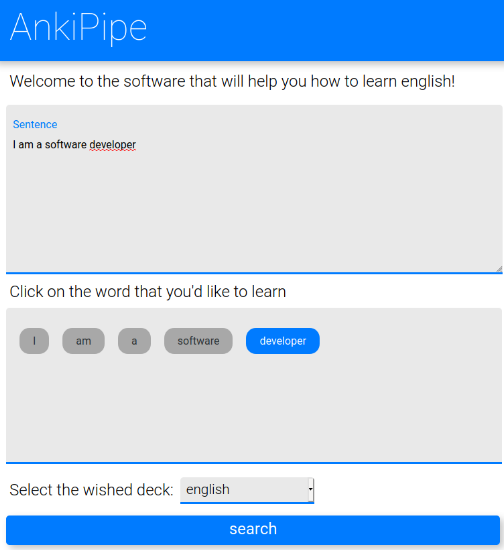

# anki-pipe2.0

## Motivation
Anki-Pipe2.0 is an enhanced version of the Anki-Pipe project, that is also of my authorship.

Anki-Pipe2.0 brings a new vision of the old project Anki-Pipe, the main motivation was to transform a project that was design for only developers to use, in a user-friendly tool for those whoo wants to improve your english skills.

## Description of the Problem and the Proposed Solution
As soon as I started to learn english, I realized the necessity to expand my vocabulary. In order to accomplish that goal, I started to read english books and face another issue, the time that I had to spend every time I discovered a new word. To make things worse, I also liked to use anki, a flashcard software to speed up my english studies.

Given all that scenario where I had to get a word from my book, search on dictionary and finally then insert it on my deck on anki. I just came up with the idea of automation, why not create a software to do all this boring process and focus on what is important? Learn a new language!


In the above picture we can see the <b>Solution architecture</b>. We bring the data from our online dictionary to our anki deck.

## Technical Architecture
As we tried to improve an old project, we based on the same technologies but we also tried to use some resources that we've never used before.

### Used Technologies
- Node.js
    - Mocha - unit tests
    - Chai - assertion library
    - sinon - stubs and mocks
    - nyc - test coverage
- Typescript - back-end programming language
- html5
- CSS3
- Javascript - front-end programming language
- HTTP2 - Native
- EJS - template library

### Methodologies and Good Practices
Many methodologies where used during the creation process of this project. The first one that I learned with <b>Uncle bob</b> in your book <b>Clean Architecture</b> is to measure the level of our <i>components / layers</i> in our software.


As we can see in the above picture, we have components that can also be seen in a perspective of a layers. But the interesting thing is that we can see that de domain is preserved on the top of all layers an not even one single arrow comes from him. 

That is to express the priority that our domain has. This component is agnostic about all the rest of the code and does not even know tha is being used among other components inside a bigger system.

Other good practice that I would like to show here is the unit tests that we built. We used mocha as our unit testing framework among sinon and nyc.


In the above picture we can see the coverage that our tests have.

## Running Anki-Pipe2.0
Once you've download anki-pipe2.0 in your machine, make sure you have node.js installed. Done that, follow the steps ahead.

Installing the needed dependencies:
```
npm install
```

Testing the software:
```
npm run test
```

In case you wanna see the tests' coverage:
```
npm run coverage
```

Running the application:
```
npm run start-dev
```

## How Anki-Pipe2.0 works
Once you've downloaded and followed the steps above, you must have anki-pipe2.0 up and running in you machine.

Accessing the url: <a href="https://localhost:3000/">https://localhost:3000/</a> you'll be redirected to the home page.


## How to use Anki-Pipe2.0
Once we're in the home page, we can type the sentence that have the word that we want to learn, select the specific word that we want to search on dictionary, select the deck that we want to use on anki and press the button search.



When the result is ready, a new area will be dinamically created on the page with the result of the dictionary. Just as follows:


On the result area, we have the indicated word, the phonetic transcription, the grammar class and its definition.